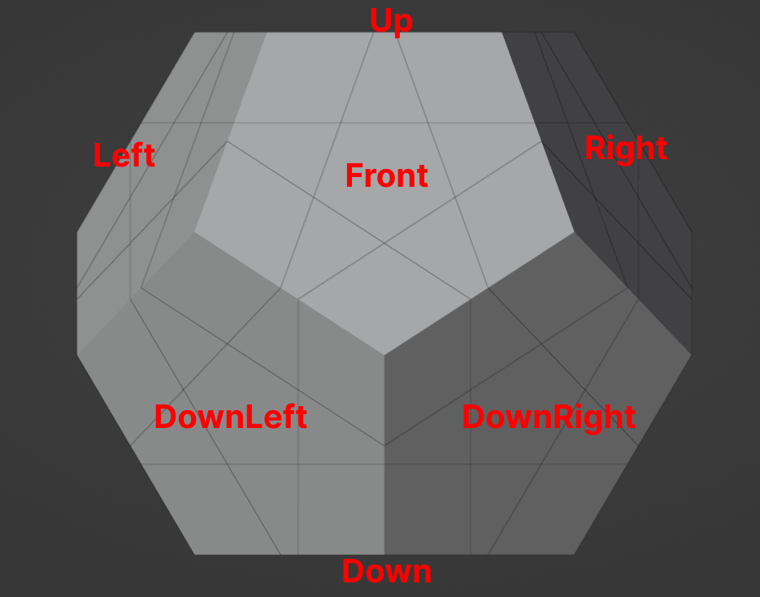
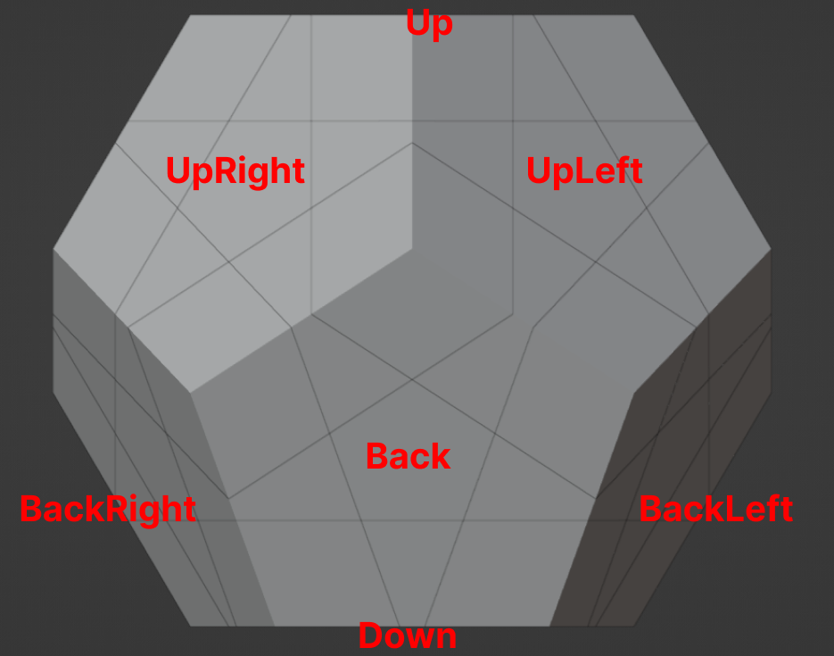

# Dodecahedron (Megaminx) Faces

<figure>
    
    <figcaption><i>Dodecahedron Front View</i></figcaption>
</figure>

<figure>
    
    <figcaption><i>Dodecahedron Back View</i></figcaption>
</figure>

In the images above, you can see all the faces of the Megaminx. The Blender model for this can be found in the `blends` folder inside the `RubikDodecahedron.blend` file.