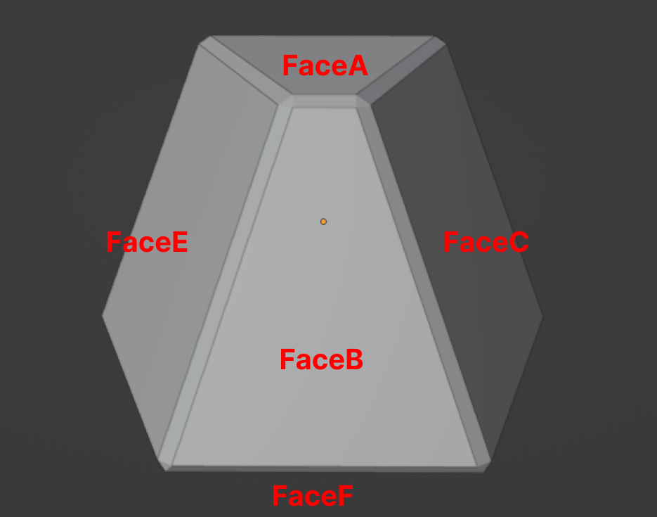
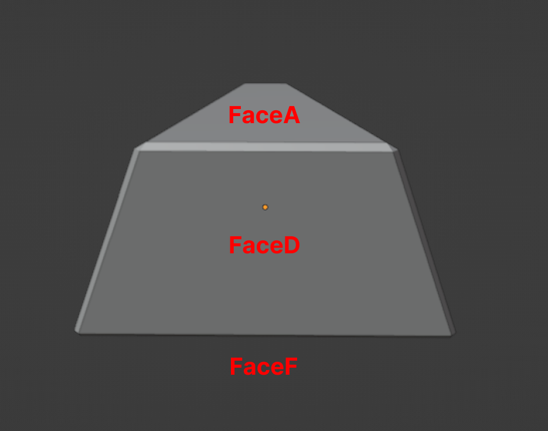
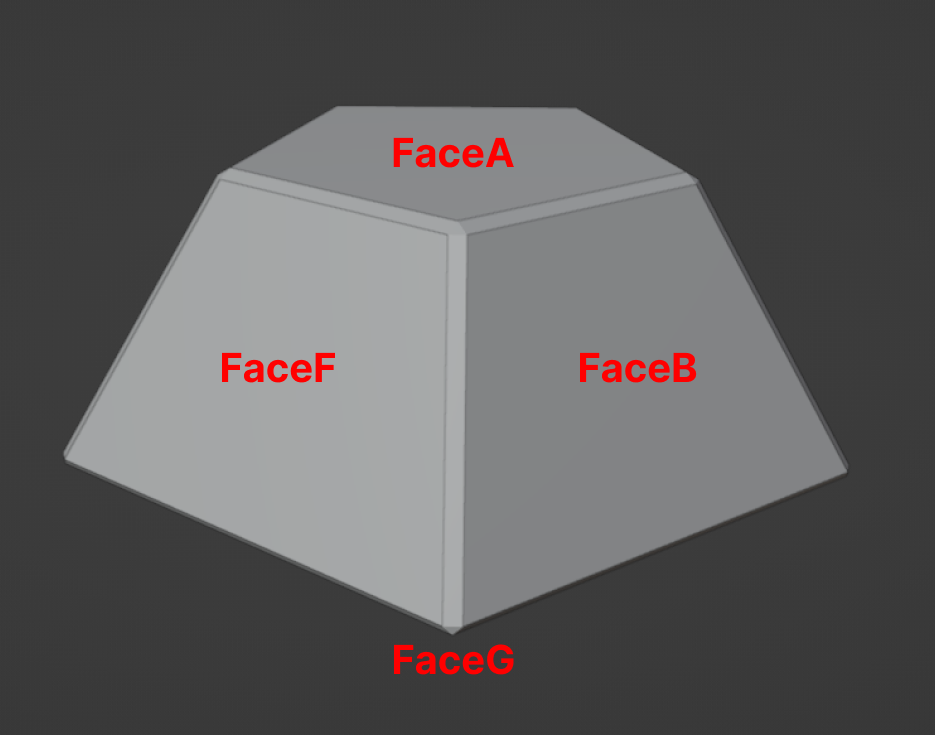
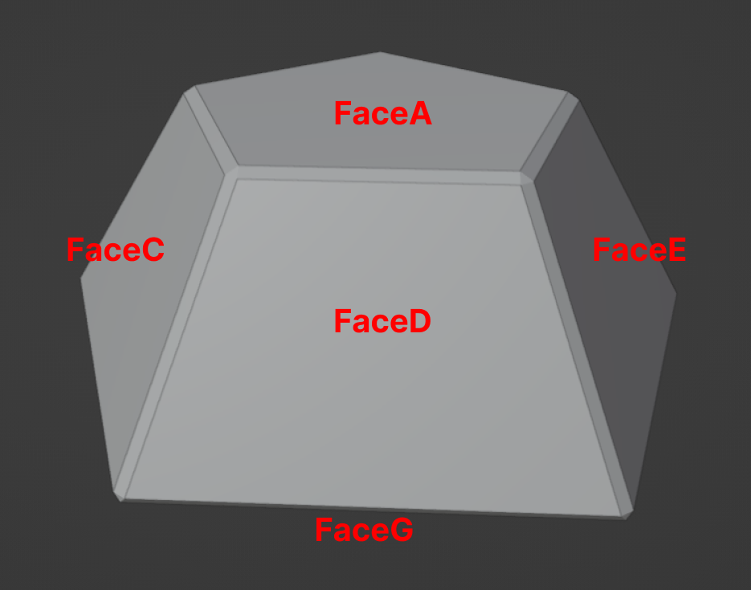
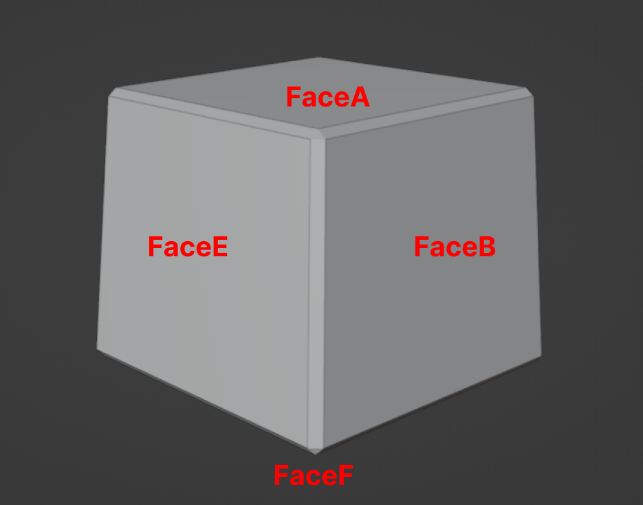
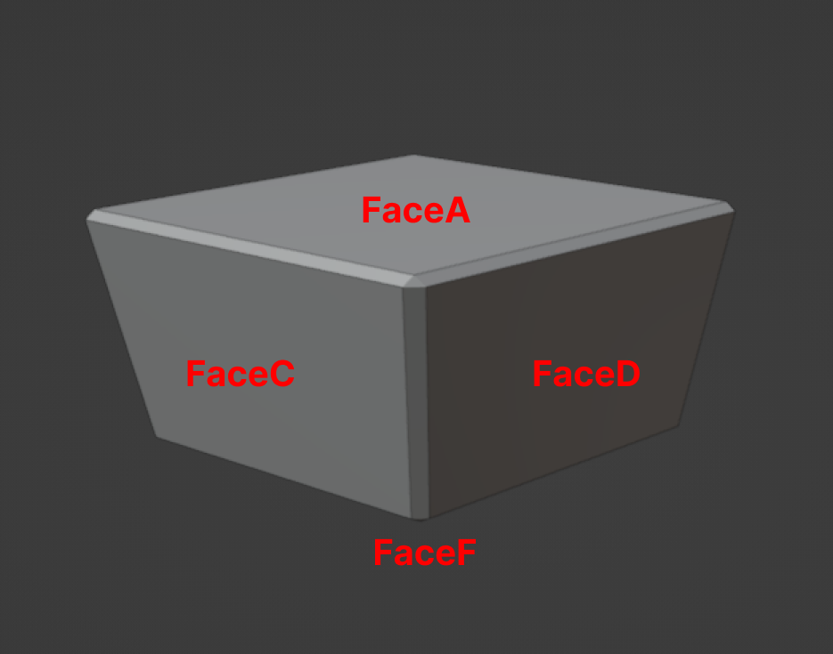

# Dodecahedron (Megaminx) Pieces Faces

This Markdown file describes the pieces that make up the Megaminx.

## Edge Piece

In the images below, you can see all the faces of the Megaminx Edge Piece. The Blender model for this can be found in the `blends` folder inside the `RubikDodecahedronEdgePiece.blend` file.

<figure>
    
    <figcaption><i>Dodecahedron Edge Piece Front View</i></figcaption>
</figure>

<figure>
    
    <figcaption><i>Dodecahedron Edge Piece Back View</i></figcaption>
</figure>

The `EdgeFace` refers to the beveled edges between the faces of the piece.

## Face Piece

In the images below, you can see all the faces of the Megaminx Face Piece. The Blender model for this can be found in the `blends` folder inside the `RubikDodecahedronFacePiece.blend` file.

<figure>
    
    <figcaption><i>Dodecahedron Face Piece Front View</i></figcaption>
</figure>

<figure>
    
    <figcaption><i>Dodecahedron Face Piece Back View</i></figcaption>
</figure>

The `EdgeFace` refers to the beveled edges between the faces of the piece.

## Vertex Piece

In the images below, you can see all the faces of the Megaminx Vertex Piece. The Blender model for this can be found in the `blends` folder inside the `RubikDodecahedronVertexPiece.blend` file.

<figure>
    
    <figcaption><i>Dodecahedron Vertex Piece Front View</i></figcaption>
</figure>

<figure>
    
    <figcaption><i>Dodecahedron Vertex Piece Back View</i></figcaption>
</figure>

The `EdgeFace` refers to the beveled edges between the faces of the piece.