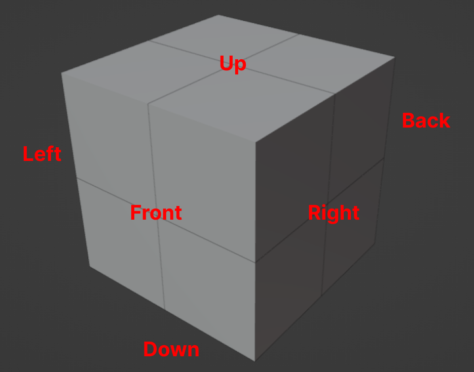

# Regular Hexahedron (Ordinary Rubik Cube) Faces

<figure>
    
    <figcaption><i>Cube Faces</i></figcaption>
</figure>

In the images above, you can see all the faces of the Rubik Cube. The Blender model for this can be found in the `blends` folder inside the `RubikCube.blend` file.