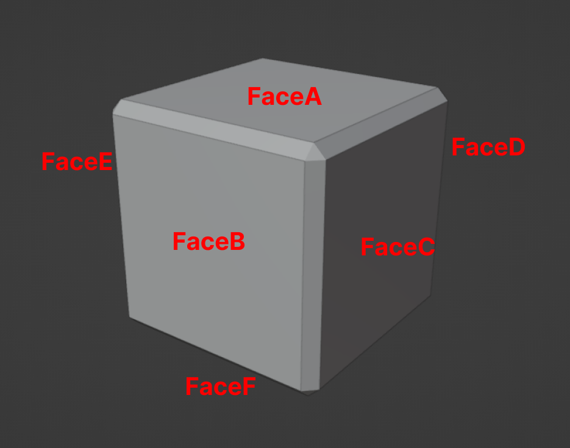

# Regular Hexahedron (Ordinary Rubik Cube) Pieces Faces

This Markdown file describes the pieces that make up the Rubik Cube.

## Rubik Cube Piece

In the images below, you can see all the faces of the Rubik Cube Piece. The Blender model for this can be found in the `blends` folder inside the `RubikCubePiece.blend` file.

<figure>
    
    <figcaption><i>Cube Piece</i></figcaption>
</figure>

The `EdgeFace` refers to the beveled edges between the faces of the piece.
