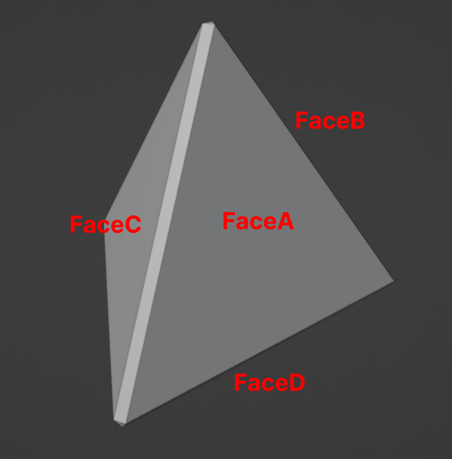
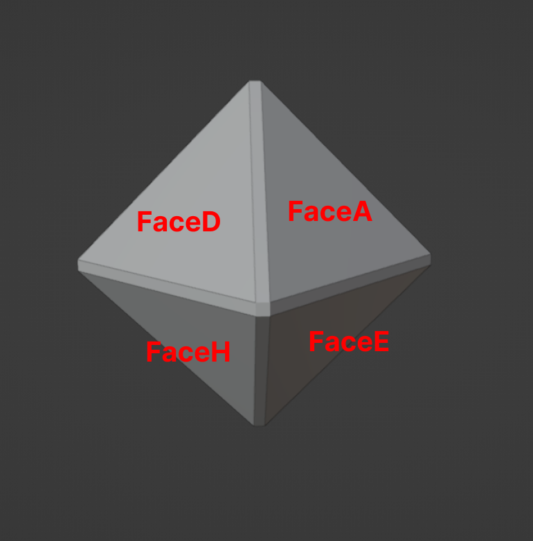
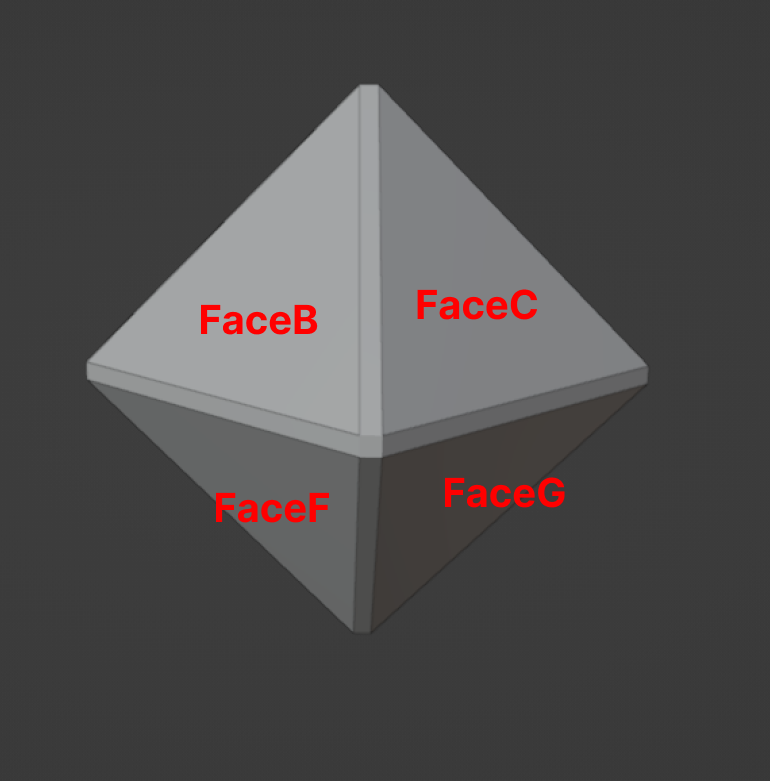

# Tetrahedron (Pyraminx) Pieces Faces

This Markdown file describes the pieces that make up the Pyraminx.

## Tetrahedron Piece

In the images below, you can see all the faces of the Tetrahedron Piece. The Blender model for this can be found in the `blends` folder inside the `RubikTetrahedronPiece.blend` file.

<figure>
    
    <figcaption><i>Tetrahedron Piece</i></figcaption>
</figure>

The `EdgeFace` refers to the beveled edges between the faces of the piece.

## Octahedron Piece

In the images below, you can see all the faces of the Octahedron Piece. The Blender model for this can be found in the `blends` folder inside the `RubikOctahedronPiece.blend` file.

<figure>
    
    <figcaption><i>Octahedron Piece Front View</i></figcaption>
</figure>

<figure>
    
    <figcaption><i>Octahedron Piece Back View</i></figcaption>
</figure>

The `EdgeFace` refers to the beveled edges between the faces of the piece.
